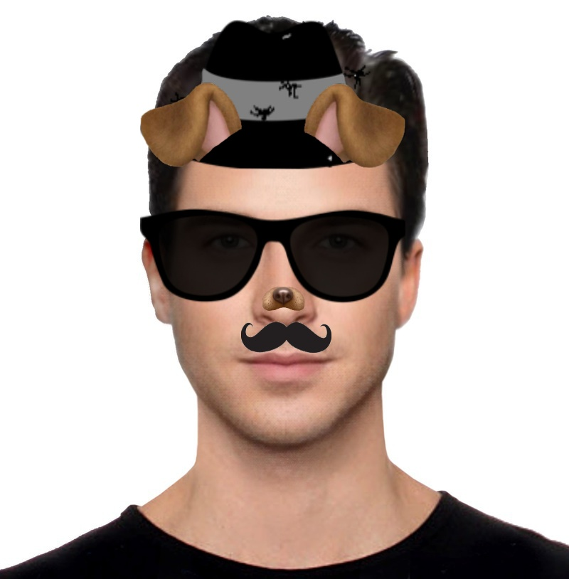

### etos simple filter

Simple Snapchat-like face filters with Python OpenCV/dlib, for [etos](https://etos.world) ecosystem.

Demo Application to play around with Snapchat-alike filters like hat, moustache and glasses automatic in-face superposition in real time.



The Dlib implementation of this app uses a [Histogram of Oriented Gradients (HOG)](https://en.wikipedia.org/wiki/Histogram_of_oriented_gradients) feature combined with a linear classifier, an image pyramid, and sliding window detection scheme to detect faces. Then it finds the 68 facial landmarks using an Ensemble of Regression Trees described in the paper [One Millisecond Face Alignment with an Ensemble of Regression Trees](https://pdfs.semanticscholar.org/d78b/6a5b0dcaa81b1faea5fb0000045a62513567.pdf).


### Requirements

```
pip install -r requirements.txt
```

### How it works

```
python main.py
```

#### Dlib face and landmarks detection

The 68 facial landmarks are numbered in the following form. With tha points we calculate the inclination so the "accessories" are also bent. Wth the points of the mouth can be detected when the mouth is open and then display some trick, like a rainbow coming out.


